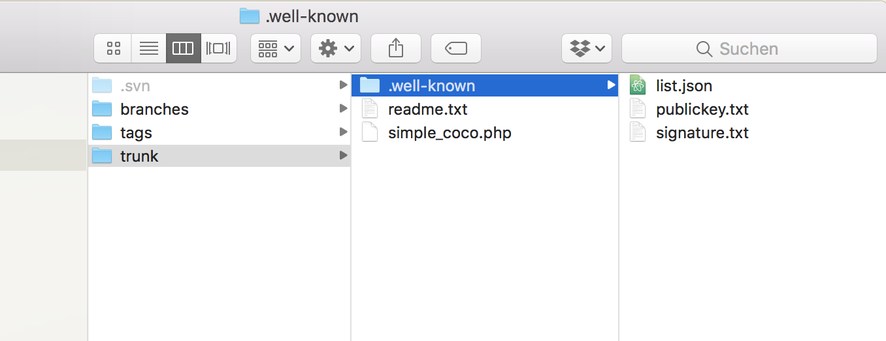
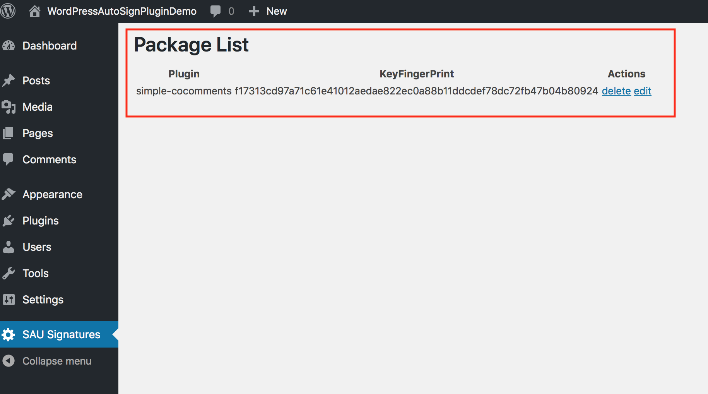
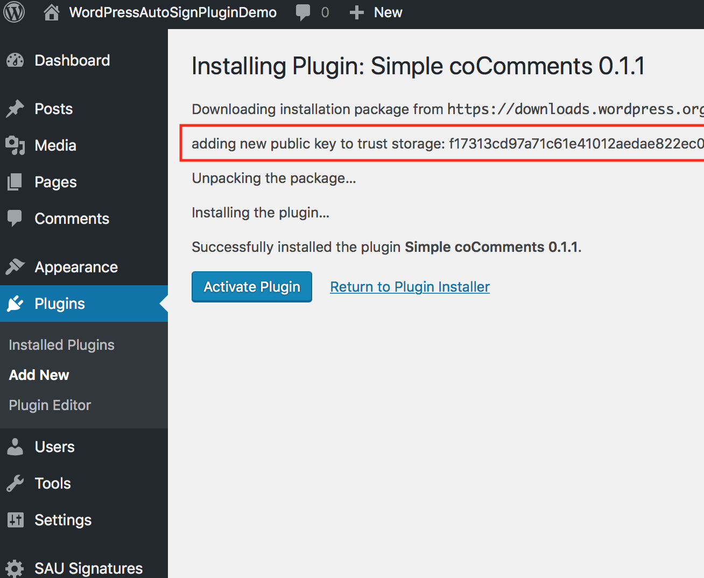
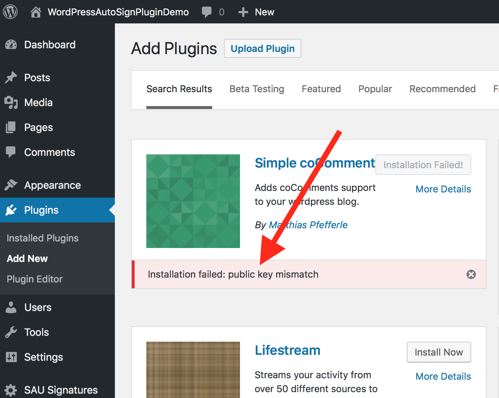

# Signed Autoupdate

## Description

Project was created on cloudfest hackathon for prototyping a signed transfer of plugin packages from developer to users. The project constists of:

- [CLI](#cli) (Tool for creation of keys and signature)
- [Client Implementation](#client-implementation) (A library to verify a package)
- [WordPress Plugin](#wordpress-plugin) (A Demo plugin having the signature checks and public key management demonstrated)
- [WordPress Test Environment](#wordpress-test-environment) (a docker based setup for developing or showing the plugin)

For testing purposes the WordPress Plugin: simple-cocomments was enhanced with .well-known/* information needed for the demonstration of signature / public key signed packing.

## Libs

### CLI

The CLI helps you to generate a keypair, to sign a package and to verify you signed package.

#### Commands

##### `generator:generate`

To generate a new keypair run:

```bash
$ signer.phar generator:generate [<path>]
```

to get the complete list of parameters use:

```bash
$ signer.phar generator:generate --help
```

##### `signer:sign`

To sign a package, navigate to the package folder and run:

```bash
$ signer.phar signer:sign [options] [--] <path> <key>
```

to get the complete list of parameters use:

```bash
$ signer.phar signer:sign --help
```

##### `signer:sign`

To verify a signed package, run:

```bash
$ signer.phar verifier:verify [<signature>] [<key>] [<list>]
```

to get the complete list of parameters use:

```bash
$ signer.phar verifier:verify --help
```

#### Build phar package

To build a new `.phar` package, you have to install [box](https://github.com/box-project/box2#as-a-global-composer-install) and run

```bash
$ box build -v
```

in the root of the `cli` folder.

#### Screens



### Client Implementation

Installation via Composer
```bash
composer require signed-autoupdate/signed-autoupdate
```

Client Implementation is straightforward you need only your download package in zip format as well as your pre-installed Public Key.

Usage example:
```php
include_once __DIR__ . '/vendor/autoload.php';

$public_key = hex2bin('<Public Key>');
$update = new Update('https://example.com/update.zip',__DIR__.'/update-deploy',$public_key);
```
If the signature fails, the number of files in the update package is off or the file hashes don't match the update will not be processed and the zip file will be discarded.

### WordPress Plugin

#### Description

Plugin will inject via add_filter into the download process of a plugin and checks for existence of some files. If
signatures existing it will try to verify the files signatures. The plugin also allows deletion and editing of public
keys.

So:

- will check for existence of: .well-known/signature.txt, .well-known/publickey.txt, .well-known/list.json
- if existing:
  - and public key is new, stores to trusted store
  - and public key is old, checks against public key the same
  - will block update if not the same keys
  - will verify with signature, public key and the list.json if the package is valid
- the SAU Signatures shows already known signatures for editing / deletion


#### Screens






### WordPress Test Environment

#### Description

The WordPress Test Environment was the idea for a one liner setup of the whole demonstration. Just execute ./do-it.sh , it will clone latest WordPress github, this repository, setup an apache with php7.2, a mysql container for the database. Uses wp-cli for setting up the wordpress with test123/test123 username on http://localhost:8091 .

For more info look into webserver/Dockerfile, docker-compose.yml and do-it.sh shell script.
